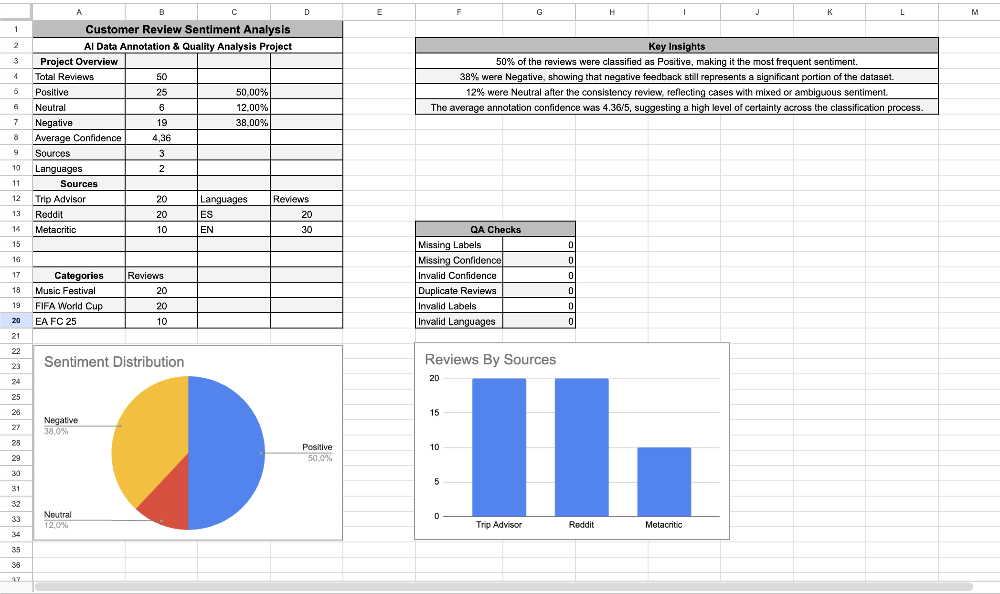

# Customer Review Sentiment Analysis

## AI Data Annotation & Quality Analysis Project

This project demonstrates a complete manual data annotation and quality assurance workflow using customer reviews collected from three different online sources.

The goal was to classify customer sentiment, assign confidence scores, document annotation decisions, validate data quality, review ambiguous cases, and transform the final dataset into an interactive dashboard.

## Project Overview

- 50 customer reviews
- 3 data sources: TripAdvisor, Reddit, and Metacritic
- 3 categories: Music Festival, FIFA World Cup, and EA FC 25
- 2 languages: English and Spanish
- Manual sentiment annotation
- Confidence scoring from 1 to 5
- Annotation reasoning for every review
- Automated quality assurance checks
- Manual consistency review and adjudication
- Interactive Google Sheets dashboard

## Annotation Methodology

Each review was manually classified into one of three sentiment labels:

- **Positive** — The review expresses satisfaction, excitement, happiness, or a clearly favorable opinion about the event or product.
- **Neutral** — The review expresses mixed feelings, ambiguity, or lacks enough clarity to determine a clearly positive or negative sentiment.
- **Negative** — The review clearly expresses anger, frustration, strong dissatisfaction, complaints, or negative experiences.

Each annotation also includes:

- **Sentiment Label**
- **Confidence Score**
- **Annotation Reason**

## Confidence Scoring

A confidence score from **1 to 5** was assigned to each annotation.

| Score | Interpretation |
|---|---|
| **5** | Sentiment is completely clear and unambiguous. |
| **4** | Overall sentiment is clear, with minor uncertainty. |
| **3** | Sentiment is partially unclear due to language, vocabulary, or difficult-to-interpret emotions. |
| **2** | Significant uncertainty due to expression, grammar, or vocabulary issues. |
| **1** | The message cannot be reliably interpreted or classified. |

## Quality Assurance

After completing the initial annotation process, the dataset was validated using automated QA checks in Google Sheets.

The following checks were performed:

- Missing sentiment labels
- Missing confidence scores
- Confidence scores outside the valid 1–5 range
- Duplicate reviews
- Invalid sentiment labels
- Invalid languages

**Final QA result: all six automated checks returned 0 errors.**

## Manual Review & Adjudication

After defining the annotation guidelines, ambiguous and mixed-sentiment reviews were manually reviewed again.

Seven cases were selected for consistency review, comparing:

- Original review text
- Sentiment label
- Confidence score
- Annotation reason
- Final annotation guidelines

As a result, **4 annotations were updated** to improve consistency across the dataset.

## Final Results

| Metric | Result |
|---|---:|
| Total Reviews | 50 |
| Positive | 50% |
| Negative | 38% |
| Neutral | 12% |
| Average Confidence | 4.36 / 5 |
| Sources | 3 |
| Languages | 2 |
| Automated QA Checks | 6 passed |

## Key Insights

- Positive sentiment was the most frequent classification, representing **50%** of the dataset.
- Negative feedback represented **38%**, showing that it remained a significant portion of the analyzed reviews.
- Neutral sentiment represented **12%** after the consistency review and primarily reflected mixed or ambiguous opinions.
- The average annotation confidence was **4.36/5**, indicating generally high confidence across the classification process.

## Dashboard

The final Google Sheets dashboard includes:

- Sentiment distribution
- Reviews by source
- Reviews by category
- Language distribution
- Key project metrics
- Quality assurance results
- Key insights

A screenshot of the final dashboard is included in this repository.

## Tools Used

- Google Sheets
- Google Drive
- GitHub
- Manual Data Annotation
- Data Quality Assurance
- Sentiment Analysis
- Data Visualization

## Skills Demonstrated

This project demonstrates practical experience with:

- Data annotation
- Sentiment classification
- Multilingual data review
- Data cleaning
- Quality assurance
- Annotation guidelines
- Confidence scoring
- Manual adjudication
- Google Sheets formulas
- Data visualization
- Analytical thinking

## Dataset
[View the annotated dataset](data/sentiment-analysis-dataset.csv)
The final annotated dataset contains 50 reviews and includes the following fields:

`ID` · `Source` · `Category` · `Language` · `Customer Review` · `Label` · `Confidence` · `Reason`

The final CSV dataset is available in the `/data` folder.

---

### Author

**Axel Gabriel Roca**

Data Annotation · AI & Business Operations · Data Analysis
